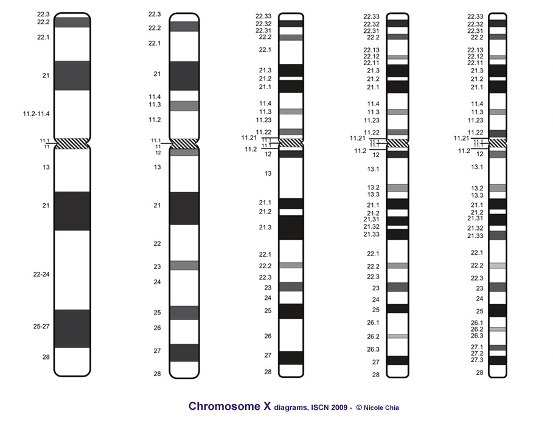
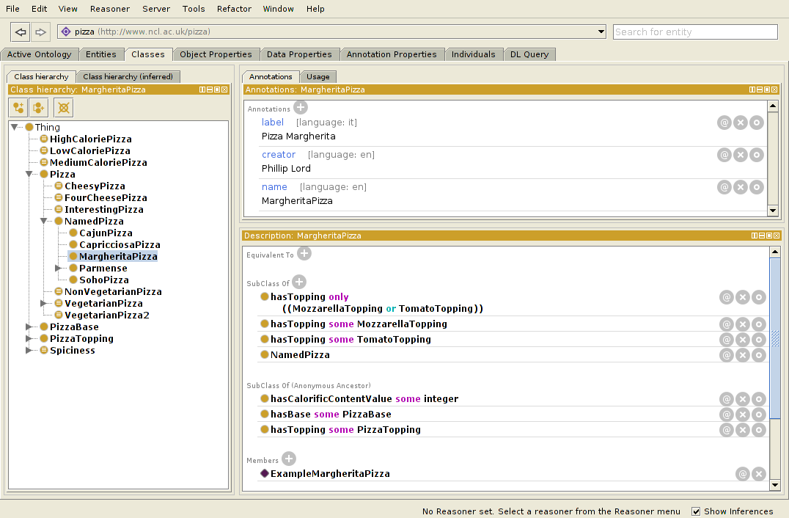

== Motivation

* Tawny-OWL was initially an accidental tool
* We did not start off writing a new environment
* We discovered we needed while trying to build an ontology

== Use Case (chromosomes)

* The human karyotype is complex to describe
* Alterations more so

ifndef::backend-slidy[]
[NOTE]
====
We didn't start out to develop a new ontology engineering tool. It happened
along the way, as we tried at address a specific use case, which was modelling
human karyotypes. 
====
endif::backend-slidy[]

== Use Case (karyotypes)

* Current, representation comes from ISCN
* Written in a book, no computational representation.

{set:incremental}

* 47,XXY
* 46,Xc,+21
* 46,XY,+21c,-21
* 45,XY,-10,der(10)t(10;17)(q22;p12)
* 46,XY,der(7)t(2;7)(q21;q22)ins(7;?)(q22;?)
* 46,XX,der(8)t(8;17)(p23;q21)inv(8)(p22q13)t(8;22)(q22;q12)
* 46,XX,der(9)del(9)(p12)t(9;22)(q34;q11.2),der(9)t(9;12)(p13;q22)inv(9)(q13q22)
* An ontological representation seems like a nice idea

{set:incremental!}

ifndef::backend-slidy[]

The current representation goes back to the days of type writers. The
specification is not machine interpretable, the ISCN strings themselves are
not interpretable, in fact, you cannot even represent them fully in ascii
because they use meaningful underlines.

endif::backend-slidy[]

== A partonomy?

* What you see is what you get?
* There are 23 chromosomes
* Around 1000 bands, at different resolution levels.

== Protege

* Could do this in protege
* Technically, it scales well to an ontology of this size

ifndef::backend-slidy[]
[NOTE]
====
Technically, 1000 terms is not a problem for protege, it can scale to this
size (or, indeed, considerably larger) with relative easy.
====
endif::backend-slidy[]

== Protege

* But the user interface does not
* Generating many similar classes is painful
* Hard to know how an axiomatisation will perform at the start
* Changing them afterwards even worse

ifndef::backend-slidy[]
[NOTE]
====
But the UI doesn't scale in this way. It involves an awful lot of clicking --
one report I have heard suggests that protege users spend upto 50% of their
time expanding and closing the hierarchy. With the karyotype ontology this
problem would be profound. Worse, with the karyotype ontology we have a
specific computational use in mind, and we don't know what the performance is
going to be like -- reasoners can change performance quite a lot with
different axiomatisations.
====
endif::backend-slidy[]

== Protege

* But the user interface does not
* We end up more like this.

ifndef::backend-slidy[]
[NOTE]
====
In practice, we are more likely to end up like this; 1000 classes is an awful
lot of clicking, particularly when many of the classes are very similar.
====
endif::backend-slidy[]

== Can we do this programmatically?

* Yes, but painfully
* OWL API -- used by many, including Protege 4
* Java and the OWL API are long-winded
* Compile-Code-Test cycle!

[source,java]
----
OWLClass clsA = df.getOWLClass(IRI.create(pizza_iri + "#A"));
OWLClass clsB = df.getOWLClass(IRI.create(pizza_iri + "#B"));
// Now create the axiom
OWLAxiom axiom = df.getOWLSubClassOfAxiom(clsA, clsB);
// add the axiom to the ontology.
AddAxiom addAxiom = new AddAxiom(o, axiom);
// We now use the manager to apply the change
m.applyChange(addAxiom);
----

ifndef::backend-slidy[]
[NOTE]
====
The main API out there is the OWL API. It's nice, but is long winded,
and difficult, both because of the complexity of a type system needed for OWL
(from the javadoc it is hard to work out which methods can be invoked on which
type), the change object system (so, you can use AddAxiom to add an annotation
to an ontology, but only if you don't care about it working), and the factory
layer. All complex.
====
endif::backend-slidy[]

== Brain

* Written by Samuel Croset, EBI
* EL only
* Compile/run cycle
* How does this fit with Java's OO?

[source,java]
----
Brain brain = new Brain();
//Add the OWL classes
brain.addClass("Nucleus");
brain.addClass("Cell");
//Add the OWL object property
brain.addObjectProperty("part-of");
//Assert the axiom
brain.subClassOf("Nucleus", "part-of some Cell");
----

ifndef::backend-slidy[]
[NOTE]
====
Another option, writtem by Samuel Croset is Brain. Much lighter weight than
the OWL API. But EL only, and it is unclear how to marry what is essentially a
script with Java's OO design. And still we keep the essential characteristics
of Java. Any changes require, recompile, restart: it is slow.
====
endif::backend-slidy[]

== The Paragon

* R provides an interactive, exploratory environment for stats
* Command line shell, wrapped by several GUIs
* Language is convienient to type and use

{set:incremental}

* It's not all good!
* The syntax can be bizzare
* The language semantics are strange

{set:incremental!}

ifndef::backend-slidy[]
[NOTE]
====
So, my paragon here is R, the statistical language. It is interactive,
convienient to use. It can be used cleanly in batch. In general, very nice.
Not to say that I want to copy all of its features though.
====
endif::backend-slidy[]

== Constraints

* Simple to do (structurally) simple ontologies
* OWL API -- too much code to rewrite
* Java (JVM) -- because of the OWL API
* Pre-existing development tooling

ifndef::backend-slidy[]
[NOTE]
====

These are the limitations that we had to live within. Most importantly of all,
I wanted it to be as simple as possible to build structurally simple
ontologies. It should largely be possible to type and write ontologies without
feeling that you are programming.

It was going to be written using the OWL API because there is too much code
there to rewrite, and no one would trust me to do that in a standards
compliant way.

This required the use of the JVM.

And I wanted access to pre-existing development tooling. I did not want to
build a complete development environment, I needed something off-the-shelf, so
that it was good.

====
endif::backend-slidy[]

== Karyotype Ontology

* What have we achieved?
* Build by Dr Jennifer Warrender
* Around 1000 classes in the karyotype ontology
* Similar numbers of tests, structural and reasoner based
* Models 10 events, with patterns for downstream use
* Multiple levels of ploidy
* Performance tested axiomatisation

ifndef::backend-slidy[]
[NOTE]
====

Before I move onto tawny-owl, what did we achieve with the karyotype ontology.
Well, I think quite a lot. We now have a large, consistent (in both the formal
and informal sense of the word) ontology that describes most levels of the ISCN.

====
endif::backend-slidy[]

